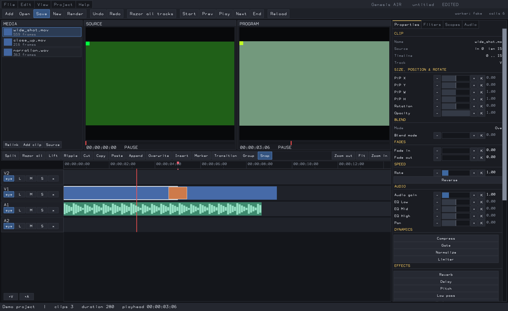

# Genesis AIR

A native non-linear video editor written in AIR.



Genesis AIR **uses** AIR; it is not part of it. The application lives here, the language,
compiler and toolkit live in their own repository, and no AIR source is copied into this
project — [`air-sdk.conf`](air-sdk.conf) records which AIR commit it is built against and
[`build.sh`](build.sh) discovers the toolchain from there.

```
Genesis AIR application     this repository
        |
        v
AIR portable toolkit        std.widgets, std.draw, std.gui, std.timeline, std.media_*
        |
        v
AIR editor/NLE toolkit      std.editor, std.editor_io, std.editor_view
        |
        v
AIR stdlib
```

## What it is

An AIR-native editing application with a tested project and control layer. Its media
renderer covers the paths listed below; the remaining mappings are tracked under Known gaps.

```
menu
toolbar        Add  Open  Save  New  Render  Undo  Redo  Razor all tracks
               Start Prev Play Next End  Reload            worker readout
+-----------+-------------------+-------------------+-------------------+
| MEDIA     | SOURCE monitor    | PROGRAM monitor   | Properties        |
|  bins,    |  own transport,   |  own transport,   | Filters           |
|  Relink   |  in/out marks     |  in/out marks     | Scopes            |
|  Add clip |                   |                   | Audio             |
|  Source   |                   |                   |                   |
+-----------+-------------------+-------------------+                   |
| Split Razor Lift Ripple  Cut Copy Paste  Append Overwrite Insert       |
| Marker Transition Group Snap                    Zoom out  Fit  Zoom in |
+-----------+------------------------------------------------+          |
| V2 eye L M S x |                                            |          |
| V1 eye L M S x |  clips, transitions, fades, markers,       |          |
| A1 eye L M S x |  waveforms, ruler, playhead                |          |
| A2 eye L M S x |                                            |          |
| +V  +A         |                                            |          |
+----------------+--------------------------------------------+---------+
status / prompt line
```

The right-hand dock has four tabs:

- **Properties** — everything about the selected clip in one scrolling column: name, source
  and timeline ranges, size/position/rotate (PiP X, Y, W, H, rotation, opacity), blend mode,
  fades, speed, audio gain, a three-band EQ with pan, dynamics (compress, gate, normalize,
  limiter), thirteen audio effects (reverb, delay and delay decay, pitch, low pass, high
  pass, tremolo, bass, treble, notch, chorus, flanger, phaser), a ten-band graphic EQ, and
  clip grade. Every parameter has a decrement, a click-anywhere bar, an increment and a
  keyframe button. A parameter whose filter does not exist yet is still shown; touching it
  creates the filter.
- **Filters** — the stack on the selected clip (enable, reorder, remove, and the selected
  filter's own parameters) above a library of **51 filter kinds**, 31 video and 20 audio.
- **Scopes** — histogram, RGB parade and luma waveform, read off the program frame that was
  already fetched for the monitor.
- **Audio** — per-track meters driven by the peak cache, and a strip per audio track with
  gain, pan, mute and solo.

Mouse gestures on the timeline: click to select, drag to move a clip between lanes and along
time, drag within seven pixels of a clip edge to trim it. A whole drag is one undo step —
nothing is written until the pointer is released — and drops snap to neighbouring cuts when
Snap is on.

The right inspector scrolls under the pointer with the mouse wheel. Its scrollbar supports
track clicks for page movement and direct thumb dragging; it does not depend on prior focus.

All of it is driven by project state, saved to and loaded from the AIR editor project schema.

The rule the whole application is built around:

```
user input  ->  editor command  ->  project state changes  ->  UI redraw
```

`std.editor.Document` is the only place a project fact lives. A widget never holds a second
copy of a clip, a track or a transport position; the view reads the document at paint time.
[`src/commands.ai`](src/commands.ai) is the single path to a mutation, and every function in
it is a snapshot capture followed by exactly one toolkit call. **There is no edit arithmetic
in this application** — split, trim, ripple, slip, roll, slide, grouping, undo/redo,
transitions, keyframes, the media pool, subtitles, the mixer and the transport model all come
from AIR's reusable NLE toolkit, which was itself derived from Genesis.

## Source map

| file | what it owns |
|---|---|
| `src/app.ai` | application state. The document is authoritative; everything else here is view state — focus, viewport, dock tab, snapping, clipboard, the in-flight pointer gesture, the prompt. |
| `src/layout.ai` | panel geometry. One function computes where every panel sits, so painting and hit testing cannot disagree about which pixels belong to which panel. |
| `src/chrome.ai` | every clickable control, built once as a list carrying its own rectangle, label and state — plus the filter library and its parameter schemas. The view paints this list; the input layer hit-tests the same list. Neither computes a rectangle. |
| `src/view.ai` | painting. Holds no project state and mutates nothing. |
| `src/input.ai` | which command a click, drag or key means. Never edits the document. |
| `src/commands.ai` | the only path to a mutation: capture for undo, then one toolkit call. No edit arithmetic. |
| `src/provider.ai` | the media seam: source probe, frame and waveform retrieval, and the worker transport. |
| `src/timeline_media.ai` | resolves AIR editor clips into the worker's preview, encode, and audio commands. |
| `src/transport_clock.ai` | advances the program playhead from monotonic elapsed time, retaining fractional frames and stopping at the end. |
| `src/main.ai` | the verbs and the window loop. |

## Build and run

```sh
cd Genesis-AIR
./build.sh                       # -> build/genesis-air

# Build the separate media worker from CodeAlexx/Genesis- (FFmpeg/OpenCL prerequisites
# are described in that repository), then point Genesis AIR at it:
cd ../Genesis
cargo build --release -p gcompose
export GENESIS_GCOMPOSE="$PWD/target/release/gcompose"
cd ../Genesis-AIR
```

```sh
# headless: paint one frame of a project
build/genesis-air render OUT.png [PROJECT.air]

# headless: build a small project, edit it, save it, paint it
build/genesis-air demo OUT.png [PROJECT.air]

# inspect source media, optionally saving a short test project
build/genesis-air probe MEDIA.mp4 OUT.png [PROJECT.air]

# compose the saved project's playhead frame, or encode its export range
build/genesis-air preview OUT.png PROJECT.air
build/genesis-air export OUT.mp4 PROJECT.air

# windowed (needs a display)
build/genesis-air open PROJECT.air
build/genesis-air new
```

The app looks for a source-built worker in the sibling `Genesis/target/release/gcompose`
relative to its own executable, then searches `PATH` for `genesis-gcompose`.
`GENESIS_GCOMPOSE` overrides discovery. `AIRC` / `AIR_HOME` override the AIR toolchain,
`GENESIS_FAKE_PROVIDER=1` forces the deterministic provider, and `GENESIS_SCRATCH` sets
the provider's scratch directory.

The window's **Export video** action now encodes an MP4. The headless `render` command still writes a
PNG of the editor canvas for layout checks. Video export requires the worker and currently
requires a 30 fps sequence and a `.mp4` output path. Existing output files are refused, and an incomplete encode is
removed on failure.

## Keys

| | |
|---|---|
| Space | play / pause |
| `s` | split at the playhead |
| Delete / Shift+Delete | lift / ripple delete |
| Ctrl+Z, Ctrl+Shift+Z, Ctrl+Y | undo, redo |
| Left / Right | frame step |
| Home / End | start / end |
| `i` / `o` | mark in / out |
| `m` | marker at the playhead |
| `g` | group the selection |
| `+` / `-`, Ctrl+wheel | zoom |
| Ctrl+C / Ctrl+X / Ctrl+V | copy / cut / paste |
| Ctrl+A | razor every track at the playhead |
| `t` | transition at the selected clip's cut |
| `n` | snapping on / off |
| Tab | next inspector tab |
| Page Up / Page Down, wheel over the dock | scroll the inspector |

Actions that need a path — Add, Open, Save-as, Render, Relink — open a prompt on the status
line: type the path, Enter to accept, Escape to cancel. The canvas window has no file dialog.

## The media provider seam

Genesis AIR never learns where a frame came from.

```
Genesis AIR
    |
    +-- editor model (std.editor)
    |
    +-- MediaProvider            src/provider.ai
            |
            +-- gcompose         the existing Genesis worker, in its own process
            +-- fake             deterministic, no FFmpeg/OpenCL/GPU
```

The provider handles probe, thumbnail, source frame, waveform and program frame requests.
`timeline_media.ai` resolves visible clips from `std.editor.Document` and builds the donor's
103-field `PREVIEW`/`ENC` wire. Preview and export use the same resolver. Export holds one
piped worker through `OPEN`, the frame and audio commands, and `CLOSE`.

**Process isolation is preserved.** Genesis measured NVIDIA OpenCL initialization crashing
intermittently against a UI GL/GLX stack, so the compositor stays out of this process. The
provider drives `gcompose --serve` as a separate process and reads its `DONE`/`ERR` reply.

`gcompose` is selected automatically when its worker is present; otherwise the fake provider
is used for editing and headless checks. Preview and export explicitly require the real worker.

## Tests

```sh
# Deterministic command, UI-control, and canvas checks.
python3 tests/run_tests.py --airc /path/to/AIR/build-gcc15/bin/airc \
  --stdlib /path/to/AIR/stdlib --binary build/genesis-air

# Bounded worker probe, preview, and MP4 check, with a small existing media fixture.
GENESIS_GCOMPOSE=/path/to/gcompose python3 tests/run_tests.py \
  --airc /path/to/AIR/build-gcc15/bin/airc --stdlib /path/to/AIR/stdlib \
  --binary build/genesis-air --media /path/to/fixture.mp4

# Generated red/blue video plus tone: compares preview/export pixels and audible AAC.
python3 tests/real_media.py --binary build/genesis-air \
  --worker /path/to/gcompose --stdlib /path/to/AIR/stdlib
```

- **122 application facts** through the command layer with the fake provider: startup,
  project create/save/load, media import, every timeline edit, selection, grouping,
  transitions, fades, keyframes, markers, subtitles, the filter stack, the mixer including
  solo-wins, both transports, elapsed-time playback, reverse sampling at mixed frame
  rates, panel focus and pool/ruler clicks, keyboard commands, and
  undo/redo compared exactly in both directions — plus the chrome: every toolbar, timeline
  toolbar, dock tab, track header and inspector control is clicked at the centre of the
  rectangle it was BUILT with, which is what proves painting and dispatch share one geometry
  rather than two that happen to agree. The drag gesture is asserted to land as a single
  undo step, and the prompt is asserted to route a committed line to the action that opened
  it.
- **594 control clicks** across the four inspector tabs. Every control the chrome builds is
  clicked at the centre of the rectangle it was built with, and the resulting document and
  application state is diffed against a baseline. Two properties are asserted, and both catch
  bugs that a screenshot cannot show: **no two enabled controls in a panel may overlap** — an
  overlapped control is unreachable and the click silently runs the one on top of it — and
  **every control must report an outcome**, so a button drawn but wired to nothing shows up.
  Rows below the fold are scrolled into view first, the way a person would.
- **Canvas smoke**: `build/genesis-air demo OUT.png PROJECT.air` paints a 1600×980 frame
  and saves its project.
- **Real media**: the worker probe reads frame count, size, frame rate and audio presence;
  the preview and MP4 paths compose two colored clips, apply a touching-cut crossfade,
  export an audio-only timeline, mix and pan a tone, apply picture and audio filters
  to the same clip, and reject an unsupported
  effect instead of silently dropping it.

## Known gaps

- Source probe, thumbnail, waveform and interactive preview still start one worker per
  request. Export uses a persistent piped worker, so it reuses decoder state for every frame.
- The media adapter currently composites two video lanes and touching-cut crossfades.
  Extra visible lanes, nested sequences, other transition kinds and overlap seams,
  subtitles, unsupported video filters, keyframed effects
  other than opacity, and the audio filters beyond gain, pan, low pass, high pass,
  tremolo, bass, treble, and limiter are refused by preview/export. The inspector
  still exposes more controls than the renderer can apply; completing their mappings and
  tests remains necessary before calling the editor fully functional.
- The worker stamps frames on a fixed 30 fps timeline. Export rejects sequences with another
  frame rate. `std.editor` currently bounds clip length in source-frame units, so a clip whose
  source rate differs from the sequence rate cannot use its entire source duration without
  further editor-model work. Preview samples source frames by the measured rate.
- The window runs export synchronously, so it does not repaint or accept cancellation during
  a long encode. The standalone `preview` and `export` commands support headless workflows.
- The program Play control now advances on a monotonic clock and skips frames after a slow
  paint; live audio playback is still missing. Encoded audio is present in exported MP4s.
- Zoom and pan live in this application (`app.Viewport`) because the AIR NLE toolkit records
  viewport policy as deliberately unported. If it proves generic it should be upstreamed.
## Provenance

Behavior oracle: [`CodeAlexx/Genesis-`](https://github.com/CodeAlexx/Genesis-) at
`b732f1c246493f029b531d3941e759b8d912bda1`, read-only and unmodified. The reusable editor
behavior was already ported into AIR; this application consumes it rather than reimplementing
it. `CodeAlexx/dif-inference` was consulted only for the `gcompose` wire; none of its server,
browser, model-capability, job-queue or Comfy-compatibility code is here.
