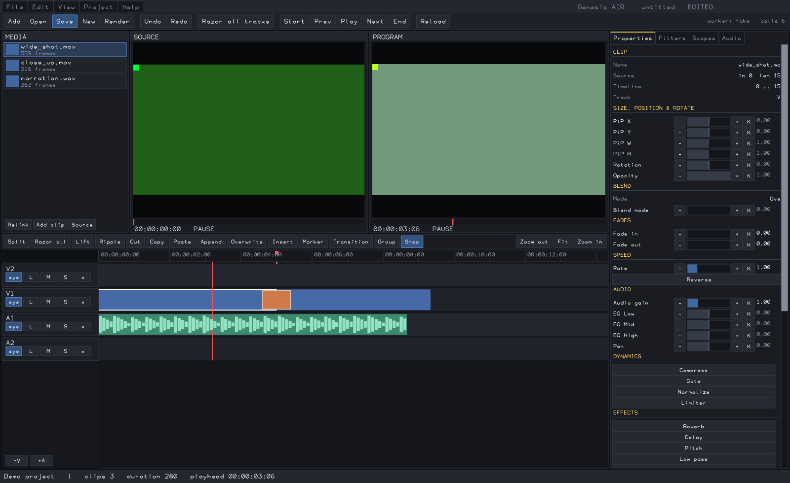

# Genesis AIR

A native non-linear video and audio editor written in AIR. The Windows build uses Win32,
Direct2D and Windows audio output. GTK is forbidden in the Windows build configuration.

Built with **AIR**, a native compiler designed for agent-assisted development: [air-lang.pages.dev](https://air-lang.pages.dev/)



Genesis AIR **uses** AIR; it is not part of it. The application lives here, the language,
compiler and toolkit live in their own repository, and no AIR source is copied into this
project — [`air-sdk.conf`](air-sdk.conf) records which AIR commit it is built against and
[`build.sh`](build.sh) discovers the toolchain from there.

```
Genesis AIR application     this repository
        |
        v
AIR portable toolkit        std.widgets, std.draw, std.gui, std.timeline, std.media_*
        |
        v
AIR editor/NLE toolkit      std.editor, std.editor_io, std.editor_view
        |
        v
AIR stdlib
```

## What it is

An AIR-native editing application with a tested project and control layer. Its media
renderer covers the paths listed below; [the control acceptance ledger](docs/CONTROL_COVERAGE.md)
tracks every exposed control and its remaining media gate.

```
menu
toolbar        Add  Open  Save  New  Render  Undo  Redo  Razor all tracks
               Start Prev Play Next End  Reload            worker readout
+-----------+-------------------+-------------------+-------------------+
| MEDIA     | SOURCE monitor    | PROGRAM monitor   | Properties        |
|  bins,    |  own transport,   |  own transport,   | Filters           |
|  Relink   |  in/out marks     |  in/out marks     | Scopes            |
|  Add clip |                   |                   | Audio             |
|  Source   |                   |                   |                   |
+-----------+-------------------+-------------------+                   |
| Split Razor Lift Ripple  Cut Copy Paste  Append Overwrite Insert       |
| Marker Transition Group Snap                    Zoom out  Fit  Zoom in |
+-----------+------------------------------------------------+          |
| V2 eye L M S x |                                            |          |
| V1 eye L M S x |  clips, transitions, fades, markers,       |          |
| A1 eye L M S x |  waveforms, ruler, playhead                |          |
| A2 eye L M S x |                                            |          |
| +V  +A         |                                            |          |
+----------------+--------------------------------------------+---------+
status / prompt line
```

The right-hand dock has four tabs:

- **Properties** — everything about the selected clip in one scrolling column: name, source
  and timeline ranges, size/position/rotate (PiP X, Y, W, H, rotation, opacity), blend mode,
  fades, speed, audio gain, a three-band EQ with pan, dynamics (compress, gate, normalize,
  limiter), thirteen audio effects (reverb, delay and delay decay, pitch, low pass, high
  pass, tremolo, bass, treble, notch, chorus, flanger, phaser), a ten-band graphic EQ, and
  clip grade. Every parameter has a decrement, a click-anywhere bar, an increment and a
  keyframe button. Slider drags update live, clamp on release outside the control, and
  form one undo step; Escape restores the previous value. A parameter whose filter does not exist yet is still shown; touching it
  creates the filter. Some keyframe actions are refused while their media automation path
  is unfinished; the [control ledger](docs/CONTROL_COVERAGE.md) tracks those gaps.
- **Filters** — the stack on the selected clip (enable, reorder, remove, and the selected
  filter's own parameters) above a library of **51 filter kinds**, 31 video and 20 audio.
  Text has an editable content field and LUT3D has a `.cube` path field. These strings
  persist in revision 2 projects; revision 1 projects still load.
- **Scopes** — histogram, RGB parade and luma waveform, read off the program frame that was
  already fetched for the monitor.
- **Audio** — live stereo output meters in dBFS after the complete mix. Tracks with sound,
  including embedded audio on video tracks, expose gain, pan, mute and solo. Selected clips
  expose their own gain, pan, EQ and audio effects. Waveforms also cover embedded video audio.

Mouse gestures on the timeline: click a clip to select it, drag a clip to move it between
lanes or along time, and drag within seven pixels of a clip edge to trim it. Each monitor has Start, Previous frame, Play/Pause, Stop, Next frame and End buttons,
plus a draggable seek bar. Seeking pauses the transport so its clock cannot override the
requested frame. Drag the ruler
above the lanes to scrub the program preview; click it to seek once. A clip move or trim is
one undo step — nothing is written until the pointer is released — and drops snap to
neighbouring cuts when Snap is on.

The right inspector scrolls under the pointer with the mouse wheel. Its scrollbar supports
track clicks for page movement and direct thumb dragging; it does not depend on prior focus.

All of it is driven by project state, saved to and loaded from the AIR editor project schema.

The rule the whole application is built around:

```
user input  ->  editor command  ->  project state changes  ->  UI redraw
```

`std.editor.Document` is the only place a project fact lives. A widget never holds a second
copy of a clip, a track or a transport position; the view reads the document at paint time.
[`src/commands.ai`](src/commands.ai) is the single path to a mutation. Each undoable action
captures one snapshot, then applies its toolkit operations. **There is no edit arithmetic
in this application** — split, trim, ripple, slip, roll, slide, grouping, undo/redo,
transitions, keyframes, the media pool, subtitles, the mixer and the transport model all come
from AIR's reusable NLE toolkit, which was itself derived from Genesis.

## Source map

| file | what it owns |
|---|---|
| `src/app.ai` | application state. The document is authoritative; everything else here is view state — focus, viewport, dock tab, snapping, clipboard, the in-flight pointer gesture, the prompt. |
| `src/layout.ai` | panel geometry. One function computes where every panel sits, so painting and hit testing cannot disagree about which pixels belong to which panel. |
| `src/chrome.ai` | every clickable control, built once as a list carrying its own rectangle, label and state — plus the filter library and its parameter schemas. The view paints this list; the input layer hit-tests the same list. Neither computes a rectangle. |
| `src/view.ai` | painting. Reads project state and caches TrueType glyphs; media work stays outside paint. |
| `src/input.ai` | which command a click, drag or key means. Never edits the document. |
| `src/commands.ai` | the only path to a mutation: capture once for undo, then apply toolkit operations. Installing another project starts a fresh history and clears project-specific media caches and clipboard. |
| `src/project_session.ai` | Save/Discard/Cancel before New, Open, Recover or Close; replacement waits for a successful save and cancelling Save as cancels the deferred action. |
| `src/recovery.ai` | independent autosave timer, separate recovery snapshots, legacy recovery reader and managed-file cleanup. |
| `src/provider.ai` | the media seam: source probe, frame and waveform retrieval, and the worker transport. |
| `src/timeline_media.ai` | resolves AIR editor clips into the worker's preview, encode, and audio commands. |
| `src/audio_playback.ai` | background audio owner; retains native clip graphs, resets transport generations and publishes coded failures. |
| `src/transport_clock.ai` | elapsed-time transport fallback; native Windows playback uses the audio device sample clock. |
| `src/native_audio.ai`, `windows/native_audio.cpp` | typed C ABI adapter for Windows audio queues, sample clock and stereo output levels. |
| `src/preview.ai` | atomic latest-request snapshots, generation-checked RGBA frames, waveforms and timeline bitmaps. |
| `src/preview_link.ai` | bounded `std.channel` command/events and native socket wake for the preview task and window. |
| `src/ui_text.ai` | cached, proportional system TrueType UI text through `std.font`. |
| `src/main.ai` | the verbs and the window loop. |

## Build and run

```sh
cd Genesis-AIR
./build.sh                       # -> build/genesis-air

# Build the separate media worker from CodeAlexx/Genesis- (FFmpeg/OpenCL prerequisites
# are described in that repository), then point Genesis AIR at it:
cd ../Genesis
git switch codex/air-raw-transition # RAW transition partners and Stabilize source frames
cargo build --release -p gcompose
export GENESIS_GCOMPOSE="$PWD/target/release/gcompose"
cd ../Genesis-AIR
```

On Windows, use PowerShell 7, Visual Studio 2022 C++ Build Tools (including CMake),
Git, and WSL Ubuntu with CMake 3.24+, Ninja and a C++20 compiler. Build AIR from the
pinned SDK with the script below. AIR emits C in WSL;
MSVC builds the Windows application. The installed editor runs directly as a Windows GUI
executable, and its redirected media subprocesses do not open console windows.

```powershell
.\setup-windows.ps1
.\build-compiler-wsl.ps1
.\build-windows.ps1 -RunTests
.\Genesis-AIR.exe open .\project.air
```

Both setup and build default to the repository root. The output includes
`Genesis-AIR.exe`, the native host/audio DLLs, `genesis-gcompose.exe`, FFmpeg DLLs and
executables, `OpenCL.dll`, `fonts/` and dependency `licenses/`. Keep these together.
The compiler builder defaults to `/root/Genesis-AIR-compiler`, a separate build tree
attached to this SDK checkout. It preserves unrelated compiler trees. Override its
`-BuildDirectory` and pass the resulting `bin/airc` to `build-windows.ps1 -LinuxCompiler`
when needed; both scripts accept `-Distro`. Rebuild the matching compiler when updating
the SDK pin, because this version uses the generic `array.copy` and `array.repeat`
operations for bulk RGBA imports and surface allocation.

Setup creates isolated SDK and compositor checkouts under `build-windows/`, applies the
tracked compositor patch, and builds the native media dependencies. Existing checkouts
at a different revision are preserved and reported. `-AirSdk` or `AIR_HOME` overrides SDK
discovery. `-Destination` stages a build elsewhere; run setup with the same destination
when preparing a complete package. `-Launch` opens the editor after building.

The SDK is pinned in [air-sdk.conf](air-sdk.conf). The compositor, OpenCL and Rust revisions
are in [windows/source-pins.json](windows/source-pins.json); FFmpeg and font downloads have
pinned digests. Windows compositor changes, including FP32 intermediates, 16-bit decoding
and encoding, HDR conversion and arbitrary preview dimensions, live in
[windows/gcompose-windows.patch](windows/gcompose-windows.patch).

```sh
# headless: paint one frame of a project
build/genesis-air render OUT.png [PROJECT.air]

# headless: build a small project, edit it, save it, paint it
build/genesis-air demo OUT.png [PROJECT.air]

# inspect source media, optionally saving a short test project
build/genesis-air probe MEDIA.mp4 OUT.png [PROJECT.air]

# compose the saved project's playhead frame, or encode its export range
build/genesis-air preview OUT.png PROJECT.air
build/genesis-air export OUT.mp4 PROJECT.air
build/genesis-air audio OUT.wav PROJECT.air   # mix audio from the playhead

# windowed (needs a display)
build/genesis-air open PROJECT.air
build/genesis-air new [--appearance dark|light|system]
```

The window enlarges the editor canvas, text, controls, and pointer targets to 1.5× on
large displays (at least 2400×1250) and 2× on 4K sized windows (at least
3200×1600). Smaller windows retain the original 1× layout. This changes only the
editor interface; project dimensions and exported video resolution stay as set in
the project.

The application first finds `genesis-gcompose.exe` beside its executable, then checks
sibling source builds and PATH. `GENESIS_GCOMPOSE` overrides worker discovery. FFmpeg and
FFprobe are also discovered beside the executable. `GENESIS_FAKE_PROVIDER=1` selects the
deterministic test provider; real preview and export require the compositor.
`GENESIS_SCRATCH` overrides state storage, which defaults to `%LOCALAPPDATA%/GenesisAIR`
on Windows. This holds recovery snapshots, preview mailboxes, export progress and `errors.jsonl`.
Coded `[GA_*]` errors appear in the status line and local structured diagnostics;
Help > Show error details reports the diagnostics path.

New, Open, Recover and closing the window ask **Save / Discard changes / Cancel** when
there are unsaved edits. Save must publish successfully before the requested action runs.
A failed save leaves the project and decision open with a `GA_SAVE_PUBLISH` error;
cancelling Save as cancels the pending action. Tab or the arrow keys choose a button,
Enter activates it, and Escape cancels. Opening a missing or invalid project preserves
the current document. A successful New/Open/Recover starts a fresh undo history and
clears the prior project's clipboard and timeline media caches.

Project saves use an exclusive sibling temporary and atomic replacement. Autosave has
its own 30-second timer, including while playback is paused with no further input.
Media/effect edits keep this interval; replacing the project allows its first snapshot
immediately. Each editing session creates a separate `.air` snapshot in `recovery` below the scratch
directory, retaining the original project path. Startup offers the newest readable
snapshot; corrupt or incomplete records are skipped and kept. **Recover** opens a paused
copy for Save as, and **Keep current** leaves the snapshot available. File > Recover autosave
opens the recovery picker, including this session's current snapshot. When Recover is
pending, the autosave timer preserves the selected snapshot until the decision is
resolved, including a picker path with different separators or ASCII letter case.
The previous plain-project `autosave.air` is still readable.
Successful Save or an accepted Discard clears this session's managed snapshots; an
ordinary project selected through Recover is never deleted. A failed autosave preserves
the previous complete snapshot and reports a `GA_AUTOSAVE_*` error.

The UI uses system Segoe UI through `std.font`, with proportional metrics and cached
antialiased glyphs. Colors come from `std.application_theme` and `std.desktop_styles`;
View selects the shared palettes. Titles and captions use installed TrueType faces and
the bundled Noto Sans JP fallback. `GENESIS_FONT` lists additional title faces, separated
by semicolons on Windows and colons on Unix. Add, Open, Save as, Export and Relink use
native Windows file pickers. On Linux they use `zenity` when available, with a keyboard
path prompt as fallback.

Export uses the sequence dimensions and rate, including fractional rates; a 4K sequence
is composed at 3840x2160 rather than an enlarged preview. File offers these profiles:

| Profile | Container | Picture | Audio |
|---|---|---|---|
| H.264 SDR | MP4 | 8-bit YUV | AAC |
| HEVC SDR | MP4 | 10-bit YUV | AAC |
| ProRes SDR | MOV | 10-bit YUV | 24-bit PCM |
| Lossless SDR master | MKV | FFV1 16-bit RGB | 24-bit PCM |
| HEVC HDR | MP4 | 10-bit PQ / BT.2020 | AAC |
| Lossless HDR master | MKV | FFV1 16-bit PQ / BT.2020 RGB | 24-bit PCM |

Media decode retains 16-bit precision and composition/intermediate passes use FP32.
The encoded format determines the final quantization. HDR sources are tone mapped to
Rec.709 for the ordinary SDR preview; HDR masters retain PQ / BT.2020. This is not a
calibrated HDR display or a scene-linear grading pipeline.

The headless `export` command selects H.264 for `.mp4`, ProRes for `.mov`, and the
16-bit SDR master for `.mkv`. `--hevc` selects HEVC SDR and `--hdr` selects an HDR
MP4 or MKV. The `render` command writes an editor-canvas PNG. Existing export files are
refused. Export runs from a project snapshot in a background task; the status reports
progress and Escape cancels between frames, during worker pipe waits, and while
waiting for the encoder to exit. Cancellation is checked in 50 ms I/O steps;
the export owner stops its worker before removing incomplete output. A final
cancellation check precedes publication. Worker, cancellation, path and publication
failures have `GA_EXPORT_*` codes; ordinary UI cancellation shows `export cancelled`.
`export.progress` and `export.cancel` in the scratch directory expose the same scriptable
progress and cancellation path.

Windows playback prepares bounded five-second WAV chunks on one background thread and
queues native audio buffers. One retained compositor session keeps each active clip's
decoder, resampler and effect graph alive across those chunks, preserving delay,
compressor and other filter history. Absolute 48 kHz sample boundaries prevent chunk
rounding from accumulating at fractional frame rates. The device's sample clock drives
the source/program playhead.
Reverse playback decodes two-second source windows from the end of the clip and feeds
the reversed PCM into the retained effect graph. Decoder/resampler preroll protects
window boundaries, and native sample counting preserves fractional source trims. This
keeps source buffering independent of clip duration while preserving delay and speed history.
Pause, Stop and seek immediately reset output; gain, pan, mute, solo and audio-effect
edits invalidate queued sound. Picture-only edits preserve it. The meters read the PCM
at the device cursor after mixing. Preview decoding runs on a separate thread; rapid
seeks publish the newest requested frame. Waveform completion is published independently
so an early image result cannot hide a later audio envelope.

Playback pipe reads and writes check Stop and superseding requests in bounded 50 ms
steps. The owning thread terminates a stale worker and removes its partial WAV;
partial write offsets and reply fragments survive ordinary short waits. An unreadable
or invalid request marker reports `GA_AUDIO_STREAM_CONTROL` and permits recovery on
the next valid request. Ordinary Stop/seek cancellation is silent.

The `audio` command writes the program mix from the current playhead for inspection.

## Keys

| | |
|---|---|
| Space | play / pause |
| `s` | split at the playhead |
| Delete / Shift+Delete | lift / ripple delete |
| Ctrl+Z, Ctrl+Shift+Z, Ctrl+Y | undo, redo |
| Left / Right | frame step |
| Home / End | start / end |
| `i` / `o` | mark in / out |
| `m` | marker at the playhead |
| `g` | group the selection |
| `+` / `-`, Ctrl+wheel | zoom |
| Ctrl+C / Ctrl+X / Ctrl+V | copy / cut / paste |
| Ctrl+A | razor every track at the playhead |
| `t` | transition at the selected clip's cut |
| `n` | snapping on / off |
| Tab | next inspector tab |
| Page Up / Page Down, wheel over the dock | scroll the inspector |

Text values and the file chooser fallback use a centered prompt: type the value, Enter to
accept, Escape to cancel.

To put a video on the timeline, use toolbar **Add** to choose and import the file, select its
row in **MEDIA**, then choose **Add clip** at the bottom of that panel. Import alone does not
place a clip. **Add clip** appends it to V1, selects it, and reports the added filename in the
status line. The ruler above the tracks controls the program playhead; drag it to scrub the
preview or click it to seek once. Use **Save** to write the project; the first save opens a
file chooser.

## The media provider seam

Genesis AIR never learns where a frame came from.

```
Genesis AIR
    |
    +-- editor model (std.editor)
    |
    +-- MediaProvider            src/provider.ai
            |
            +-- gcompose         the existing Genesis worker, in its own process
            +-- fake             deterministic, no FFmpeg/OpenCL/GPU
```

The provider handles probe, thumbnail, source frame, waveform and program frame requests.
`timeline_media.ai` resolves visible clips from `std.editor.Document` and builds the donor's
103-field `PREVIEW`/`ENC` wire. Preview and export use the same resolver. Export holds one
piped worker through `OPEN`, the frame and audio commands, and `CLOSE`.

**Process isolation is preserved.** Genesis measured NVIDIA OpenCL initialization crashing
intermittently against a UI GL/GLX stack, so the compositor stays out of this process. The
provider keeps one `gcompose --serve` process open for probes, thumbnails, waveforms and
previews, so OpenCL starts once and decoders stay open between requests. A worker that exits
or crashes is replaced once and the request retried. Reload and Relink restart it so changed
files are read again. Export runs its own worker.

`gcompose` is selected automatically when its worker is present; otherwise the fake provider
is used for editing and headless checks. Preview and export explicitly require the real worker.

## Playback and seeking on Windows

Each monitor has Start, Previous frame, Play/Pause, Stop, Next frame and End, plus
**Full** for fullscreen playback. F11 opens the focused monitor; Esc or **Exit full**
restores the editor. Transport buttons and the draggable seek bar remain available
in fullscreen. Fullscreen uses a 1280x720 monitor surface; the editor uses 480x270
surfaces. Export resolution comes from the sequence. Space plays or pauses.
Ctrl+O opens a project and Ctrl+S saves it;
Ctrl+Shift+S opens Save as.

Drag the timeline ruler or the playhead line to change program time and preview.
The line takes precedence over a clip underneath it, so seeking cannot move or
trim that clip. Video/audio lane crossing is refused with `GA_TRACK_KIND`. Cached
frame bitmaps fill visible video clips through a separate background decoder, including during playback;
sampling follows the painted thumbnail width instead of leaving large empty gaps;
waveforms also appear on video clips that contain audio.

Both monitors reuse unchanged pictures. Source transport changes keep the program
picture, while timeline edits refresh it. Reload, Relink and opening a project
invalidate the background media cache, including LUTs replaced at the same path.
Timeline thumbnails and waveforms use their own request lane and provider. Transport
and selection changes reuse the same strip request, so playback does not repeatedly
cancel extraction. Clip edits, viewport changes and media reloads request fresh strips.
Each bitmap records its native source frame and timeline position; readers and painting
refuse an obsolete mapping after a trim, move, reverse or rate change. Waveforms carry
their source endpoints and length. Incomplete strip slots retain the last owned pictures.

Monitor timecodes use the decoded picture's frame stamp. During playback the timeline
cursor follows that same program frame; paused scrubbing changes the requested position
immediately. RGB histogram channels have independent bars, including equal-height bins
in black and white frames, and refresh from the displayed program picture.

Preview requests and completed frames wake the worker and native window wait through
bounded `std.channel` lanes. Rapid drag requests are coalesced before decoding; frame,
waveform and thumbnail completion have separate events. Document, viewport, monitor
quality and media revision publish as one atomic request snapshot. Monitor pixel
packets carry decoded source/program frame stamps and media revision along with their
dimensions and generation. Diagnostic file slots and timeline strip slots invalidate
their generation before reuse. The reader retains its last complete picture if a slot
changes. This prevents a
rapid scrub from displaying mixed generations or replacing a held frame with an
incomplete publication. `GA_PREVIEW_REQUEST`, `GA_PREVIEW_GEOMETRY`,
`GA_PREVIEW_PUBLISH`, `GA_PREVIEW_PIXELS`, `GA_TIMELINE_REQUEST` and `GA_PREVIEW_CHANNEL` identify request, size, pixel publication
and delivery failures. Request errors carry their generation so a later valid
request can recover. An idle lifecycle deadline also observes persisted Stop if
its wake was lost; normal frame work wakes immediately.

The worker keeps decoder image buffers between frames, composes in FP32, and packs
the final preview on the GPU before downloading it. FLOAT intermediates and master
exports retain their precision. Windows uses D3D11 decoding when supported and prefers
a discrete OpenCL GPU on hybrid PCs. Software decoding remains available with
`GENESIS_SOFTWARE_DECODE=1`; `GENESIS_OPENCL_DEVICE` selects a GPU by name substring.
`GENESIS_MEDIA_PROFILE=1` emits colour, RGB conversion and preview phase timings.

A 120-sample measurement of consecutive frames on the supplied 4K/59.94 AV1/PQ clip
and RTX 5080 reached 59.49 worker previews per second at a 1280x720 working canvas,
with identical frame-zero pixels after rewind. This excludes Windows canvas painting,
mailbox conversion and audio; sustained 60 fps in the editor and long-run
synchronization are still acceptance work. The diagnostic defaults to 120 consecutive
frames; `--frame-step 2 --samples 30` reproduces the older sampling pattern.

```powershell
python tests/preview_performance.py --worker .\genesis-gcompose.exe --source 'C:\path\to\clip.mp4'
```

The shared AIR rasterizer now computes axis-aligned rectangle coverage and image
sampling directly, preserving the existing pixels at fractional DPI and under reflection.
Genesis borrows its RGBA window surface through `std.gui.present_surface`; the native
host performs format conversion once, avoiding an AIR RGB24 allocation and a repeated
Windows swizzle. The monitor resampler also uses integer source indices. Shared `array.copy_from`
and `array.copy_within` copy bounded plain-element spans without growing the array.
The resampler reserves its exact RGBA byte length, copies RGB spans and reuses
repeated rows while preserving its existing alpha and letterbox behavior. The
rasterizer reuses an opaque sampled interior row, trimming fractional edge columns
outside the image; transparent rows blend independently against their backgrounds.
Opaque rectangle interiors also reuse their first fully covered row. Fractional
rectangle edges and transparent fills keep independent destination blending.

Playback retains the window canvas and repaints the monitor pictures/timecodes,
old/new playhead strips, status, and live scopes/audio or animated inspector values.
Input and project/layout changes request a complete paint; project dialogs, open menus/prompts,
changed picture dimensions also use a complete paint. Each retained monitor paint
restores its panel bands and picture background before compositing, including transparent
frames, so neither image needs a separate alpha scan. The opaque picture interior
overwrites its destination once. Closing an overlay also repaints its former pixels.
Physical pixel damage boundaries preserve fractional-DPI edges. The window transfers
monitor RGBA pixels through bounded `std.channel` chunks, preserving alpha. Each complete
frame validates dimensions, byte lengths and generation before becoming visible. A held
source monitor is neither decoded nor transferred again; its last received pixels survive
coalesced program frames. Credit waits retry in 50 ms steps and watch Stop/seek markers,
so a slow consumer can resume without accepting an incomplete frame. File image slots
remain available for headless diagnostics through `--file-pixels`.

Three paired editor runs on the supplied 4K/59.94 AV1/PQ clip compare the stream
with file delivery in the same build. Each run uses 120 samples after three warmups
at 2560x1440, with 480x270 monitor surfaces; pair order alternates. The table gives
the median of the three per-run medians:

| Median phase (ms) | Pixel stream | File diagnostic |
|---|---:|---:|
| Request to ready notification | 25.99 | 28.90 |
| Import completed images | 0.07 | 4.10 |
| Worker frame publication | 0.26 | 3.10 |
| Retained canvas paint | 2.47 | 2.50 |
| Complete serial diagnostic | 28.58 | 35.28 |

The serial diagnostic takes about 19% less time. Program-monitor preparation
remains 23.52/23.53 ms, so decoder/compositor work is still the largest measured
cost. These runs exclude native presentation, audio and pipeline overlap;
sustained smooth 4K60 is not established. Current work targets ordinary editor
playback; fullscreen 4K work is deferred.

At the retained-painter checkpoint (`77ea56a`), retained painting took 7.39 ms
median versus 42.23 ms for a complete paint. AIR now provides true nonblocking
socket accept/receive operations, which `std.channel.recv_now` uses instead of a
timed empty read. The profile found that the former half-millisecond deadline
actually delayed an empty wake-coalescing pass by 11.55 ms on Windows. The final
build drains that queue in 0.03 ms median, without changing blocking
channel delivery or discarding partial greetings/frames.

The opaque-background checkpoint was measured with 20 samples after three
warmups on the supplied 4K/59.94 AV1/PQ clip and RTX 5080 in a 2560x1440 canvas:

| Median phase (ms) | Editor | Fullscreen |
|---|---:|---:|
| Request to ready notification | 27.83 | 29.97 |
| Load generation-checked images | 2.41 | 3.30 |
| Retained canvas paint | 2.52 | 6.69 |
| Complete serial diagnostic | 33.28 | 39.59 |

The baseline before panel-band clearing and opaque rectangle row reuse
measured 6.01/21.69 ms painting and 40.01/58.37 ms serial. Painting fell 58% in the
editor and 69% fullscreen. The preceding retained-alpha checkpoint measured
6.00/21.82 ms painting and 36.34/55.32 ms serial; request timing varied between runs.

The opaque-row/span-copy checkpoint (`d5a7d25`) measured 6.12/22.54 ms painting
and 35.80/56.11 ms serial in editor/fullscreen. Before opaque-row reuse,
`8203d66` measured 7.10/27.48 ms painting
and 37.21/60.54 ms serial. The earlier channel-wake checkpoint
(`25178c9`) measured 37.87/35.72 ms request-to-ready and 46.95/66.54 ms serial.
These short headless samples exclude native presentation, audio and pipeline
overlap; they are not an interactive frame-rate claim. Fullscreen CPU painting
and program-monitor preparation remain significant costs. Sustained smooth
4K60 remains unfinished.

```powershell
.\Genesis-AIR.exe profile-preview .\preview-profile.json .\project.air 2560 1440 120
.\Genesis-AIR.exe profile-preview .\file-profile.json .\project.air 2560 1440 120 --file-pixels
.\Genesis-AIR.exe profile-preview .\fullscreen-profile.json .\project.air 2560 1440 20 --fullscreen
.\Genesis-AIR.exe profile-preview .\full-paint-profile.json .\project.air 2560 1440 20 --full-paint
```

This command opens no window. Its `std.bench` JSON separates request-to-ready, completed
image loading, retained painting, borrowed presenter handoff and the serial pipeline.
It also records wake coalescing, snapshot read/decode, source monitor, frame planning,
program monitor, image publication and remaining request time. Those worker phases
carry their frame generation, and their warmup/sample counts match the outer pipeline.
The default profile follows the window's pixel stream; `--file-pixels` reproduces the
file-slot diagnostic for comparison. Phase clocks are measured in the explicit profile.
`--full-paint` measures a complete paint for comparison; it combines with `--fullscreen`. It validates
published image dimensions and a painted panel pixel so an empty frame cannot pass.
`GA_PROFILE_ARGS` identifies invalid dimensions/sample counts; `GA_PROFILE_PREVIEW`
identifies a missing frame; `GA_UI_PRESENT` reports a native presentation failure in the editor.

## Tests

Windows acceptance checks:

```powershell
.\build-windows.ps1 -RunTests -NativeBuild .\build-windows\native-pro
$env:GENESIS_WORKER_WRAPPER = (Resolve-Path .\build-windows\native-pro\bin\Release\genesis-worker-wrapper.exe).Path
python tests/real_media.py --binary .\Genesis-AIR.exe --worker .\genesis-gcompose.exe --stdlib .\build-windows\AIR-SDK\stdlib
python tests/pro_media.py --binary .\Genesis-AIR.exe --worker .\genesis-gcompose.exe
python tests/precision_media.py --binary .\Genesis-AIR.exe --worker .\genesis-gcompose.exe
```

The Windows gate verifies 152 saved application facts, three native file-drop facts,
749 control clicks with overlap checks, 78 native media/project checks and 81 focused
inspector/transport/audio checks. Native device tests verify queueing, advancing sample
clock, stereo, panned and silent output levels and immediate Stop. Continuous audio checks compare four
worker cases and thirty-three editor/source/rate/mixer cases against whole-range WAV output;
the generated PCM fixture matches exactly across chunk boundaries. Cases cover all twenty
effects, reverse, 2x speed, fractional rates, seek reset and source audition, plus coded
filter failure, recovery and idle Stop. Six additional native cases interrupt a worker
blocked on a reply or a large stdin write: Stop, seek, and missing request-marker
failure. They verify child exit, partial cleanup, coded failure/recovery and exact
recovered PCM. Active Stop joined in 166–169 ms and seek recovery took 315–317 ms
in the latest headless run; these are stalled-process checks, not interactive A/V
sync measurements. Run that gate separately with:

```powershell
python tests/audio_stream.py --worker .\genesis-gcompose.exe --client .\build-windows\native-pro\bin\Release\genesis-audio-playback.exe --cancel-client .\build-windows\native-pro\bin\Release\genesis-audio-cancel.exe --wrapper .\build-windows\native-pro\bin\Release\genesis-worker-wrapper.exe
```

The Windows gate also compares sixty-second and ten-minute reversed PCM sources,
unequal output pulls, continuous reverse/delay/2x output, fractional 44.1 kHz trims and
a complete twelve-second AAC reversal against independent samples or a whole pass.
Its native process memory check rejects growth proportional to clip duration. In one
paired run, the ten-minute fixture used 160.10 MiB peak worker memory versus 388.60 MiB
before; first-buffer preparation, including process startup, took 172.00/246.48 ms.
These are headless source/filter measurements. Reproduce it or also check supplied media with:

```powershell
python tests/audio_reverse.py --worker .\genesis-gcompose.exe --report .\build-windows\reverse-audio-profile.json
python tests/audio_reverse.py --worker .\genesis-gcompose.exe --media "C:\path\to\video.mp4"
```

The asynchronous preview test measures
red/blue pixels after a 32-request playhead drag, time changes during the drag,
unchanged source caching, rewind to frame zero, painted timeline bitmaps and embedded
audio waveform delivery. It also verifies coded malformed-request/publication
failures, recovery on the same worker, refusal of a reused frame slot, fullscreen
720p frames, in-place LUT reload and idle cancellation without a Stop wake.
The pixel-stream gate adds nine native transport cases: exact RGBA bytes in two
1280x720 surfaces, a consumer paused for 250 ms, held/empty/coalesced source
updates, Stop/seek during backpressure and coded malformed-frame recovery.
Generated-media requests check independent source/program seeking and decoded frame
stamps, monitor size changes, rewind, Reload, a 32-request drag burst, strip extraction
during playback, matching bitmap pixels after reverse/trim/2x rate, stale/incomplete
strip refusal, absent monitor frame files and
idle Stop. Project safety has 15 cases /
84 checks for Save/Discard/Cancel, native close-request dispatch, failed-save retry,
separate snapshots, paused final-edit autosave, atomic failure preservation, legacy
recovery and selecting the active snapshot without replacing it while the decision is
open. It verifies original files stay intact, including a normal project inside the
recovery directory. Dialog images are rendered headlessly; the new picker/modal flow
still needs an interactive Windows check. An additional 24-case / 444-check pixel gate
compares retained playback against the complete painter byte for byte:
all four docks at 1x/1.5x/2x, changing images, forward seeks and rewind, fullscreen,
resize, transport changes, alpha, themes, menus, prompts, keyed inspector values and
project-decision/Save as cancellation without stale overlay pixels. Nine cases
exercise fixed-size opaque/transparent frame transitions across three canvas scales
in the editor and both fullscreen monitors.
The generated-media suite covers effects, transitions, captions, Unicode, audio-only
projects, worker crash recovery and export cancellation/cleanup.
The Windows gate also stalls export opening, frame encoding, audio mixing, closing
and final worker exit. Each case verifies cancellation, the old PID's exit, partial
cleanup and a successful same-path retry with six video frames and audible audio.
Existing final files and foreign partial files are preserved with coded refusals.
The five stalled-process cancellations took 108–162 ms in the latest full Windows
gate. Run the export gate separately with:

```powershell
python tests/export_cancel.py --binary .\Genesis-AIR.exe --worker .\genesis-gcompose.exe --wrapper .\build-windows\native-pro\bin\Release\genesis-worker-wrapper.exe
```

Run the generated-media suite on Windows with its native worker wrapper configured:

```powershell
$env:GENESIS_WORKER_WRAPPER = (Resolve-Path .\build-windows\native-pro\bin\Release\genesis-worker-wrapper.exe).Path
python tests/real_media.py --binary .\Genesis-AIR.exe --worker .\genesis-gcompose.exe --stdlib .\build-windows\AIR-SDK\stdlib
python tests/pro_media.py --binary .\Genesis-AIR.exe --worker .\genesis-gcompose.exe
```

The pro-media suite measures 4K detail, fractional rate, ProRes/24-bit PCM, portrait
preview/export aspect ratio and exact multicam cuts. The precision suite measures 1024
distinct values through a filtered three-layer 16-bit master and audible samples after
181 seconds. It also verifies 100-nit HDR title white and HEVC 10-bit PQ/BT.2020
output. Its optional `--hdr-source PATH` checks a supplied 4K PQ source against a
lossless master and FFmpeg's floating-point SDR tone-map reference. See the
[control acceptance ledger](docs/CONTROL_COVERAGE.md) for scope and remaining work.

The following Unix/X11 checks are historical reproduction commands. The current native
Windows audio adapter has not been validated on Linux:


```sh
# Deterministic command, UI-control, and canvas checks.
python3 tests/run_tests.py --airc /path/to/AIR/build-gcc15/bin/airc \
  --stdlib /path/to/AIR/stdlib --binary build/genesis-air

# Bounded worker probe, preview, and MP4 check, with a small existing media fixture.
GENESIS_GCOMPOSE=/path/to/gcompose python3 tests/run_tests.py \
  --airc /path/to/AIR/build-gcc15/bin/airc --stdlib /path/to/AIR/stdlib \
  --binary build/genesis-air --media /path/to/fixture.mp4

# Generated red/blue and mixed-rate video plus tone: compares pixels and audible AAC.
python3 tests/real_media.py --binary build/genesis-air \
  --worker /path/to/gcompose --stdlib /path/to/AIR/stdlib

# Optional X11 Play/Pause canvas check (requires python-xlib and an X display).
python3 tests/window_playback.py --binary build/genesis-air \
  --stdlib /path/to/AIR/stdlib

# Optional X11 import, timeline placement, ruler scrub, and save check.
python3 tests/window_file_picker.py --binary build/genesis-air \
  --stdlib /path/to/AIR/stdlib

# Exercise the same path at 4K with a generated video and the real worker.
python3 tests/window_file_picker.py --binary build/genesis-air \
  --stdlib /path/to/AIR/stdlib --maximized --worker /path/to/gcompose

```

- **152 application facts** through the command layer with the fake provider: startup,
  project create/save/load, media import, every timeline edit, selection, grouping,
  transitions, fades, keyframes, markers, subtitles, the filter stack, the mixer including
  solo-wins, both transports, elapsed-time playback, reverse sampling at mixed frame
  rates, panel focus and pool/ruler clicks, keyboard commands, and
  undo/redo compared exactly in both directions — plus the chrome: every toolbar, timeline
  toolbar, dock tab, track header and inspector control is clicked at the centre of the
  rectangle it was BUILT with, which is what proves painting and dispatch share one geometry
  rather than two that happen to agree. The drag gesture is asserted to land as a single
  undo step, and the prompt is asserted to route a committed line to the action that opened
  it.
- **749 control clicks** across the four inspector tabs. Every control the chrome builds is
  clicked at the centre of the rectangle it was built with, and the resulting document and
  application state is diffed against a baseline. Two properties are asserted, and both catch
  bugs that a screenshot cannot show: **no two enabled controls in a panel may overlap** — an
  overlapped control is unreachable and the click silently runs the one on top of it — and
  **every control must report an outcome**, so a button drawn but wired to nothing shows up.
  Rows below the fold are scrolled into view first, the way a person would.
- **Canvas smoke**: `build/genesis-air demo OUT.png PROJECT.air` paints a 1600×980 frame
  and saves its project.
- **Real media**: the worker probe reads frame count, size, frame rate and audio presence;
  the preview and MP4 paths compose three colored clips in track order, add a timed caption,
  apply all eleven transition kinds across a touching cut, plus overlapping and
  short-gap crossfades, and check gamma, sepia, vignette, levels, crop,
  keyed overlay pixels, Text and Timer previews and exports,
  Stabilize on a synthetic shaky clip with keyed Strength and an upper-lane export,
  export an audio-only timeline, verify a 24 fps source across a full 30 fps sequence
  second, write an audible playback WAV (including a spaced output
  path), export a nine-frame 24 fps sequence with audio,
  retime and reverse a rising tone, keep freeze-frame
  audio silent, mix and pan a tone, apply picture and audio filters
  to the same clip, and reject an unsupported
  effect instead of silently dropping it.

## Known gaps

- Compressed-source seek startup can differ
  slightly from whole-range WAV decoding; generated PCM continuity checks do not establish
  sample-identical seeking for every codec.
- Nested sequence rendering, audio automation, animated speed and some filter combinations
  remain unsupported and are refused explicitly. The library has mappings for 31 video and
  20 audio effects; representative output checks do not establish every parameter value,
  ordering combination or keyframe behavior.
- The source/program transport uses a Windows audio sample clock, but sustained preview
  throughput and long-timeline synchronization still need measured acceptance on larger
  projects. Scrubbing updates pictures while paused; it does not audition audio continuously.
- HDR preview is SDR tone mapped, and scopes describe that preview. The HDR master path
  preserves PQ precision and color tags, but reference-monitor output and scene-linear
  compositing are not implemented.
- Text uses per-scalar TrueType glyphs. Complex shaping and right-to-left layout need more
  work. Captions use a fixed lower-third position. Uncovered glyphs are refused with their
  Unicode code point.
- Stabilize estimates translation within 24 output pixels. Rotation, perspective and long
  camera-path smoothing are not implemented.
- Worker exchanges have bounded deadlines and preview runs outside the window thread.
  Reload or Relink is needed after replacing source media or a LUT file in place.
- Export cancellation takes effect between frames; a slow frame finishes first. Output
  destinations are created only when absent, and partial output is cleaned after failure.
